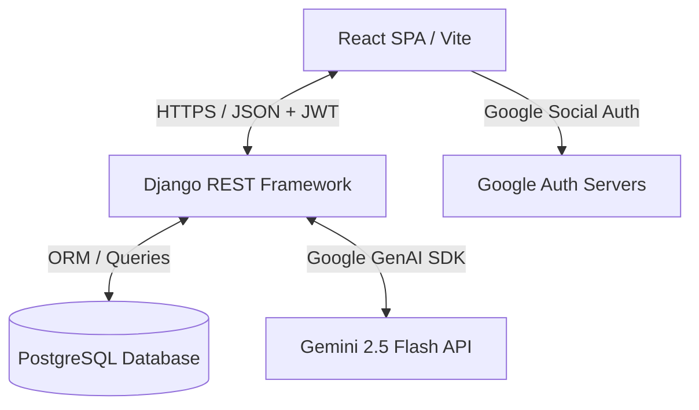

# 🥗 NutriAI — AI-Powered Personalized Nutrition & Wellness Coach

[](https://react.dev/)
[](https://www.djangoproject.com/)
[](https://deepmind.google/technologies/gemini/)
[](https://www.postgresql.org/)
[](https://youtu.be/9mq1PCSzN14)

NutriAI is a state-of-the-art, AI-powered health and wellness application that bridges the gap between vision-based food logging and personalized medical/dietary coaching. By combining **React** on the frontend, **Django REST Framework** on the backend, and **Google Gemini 2.5** as the core intelligence engine, NutriAI acts as a 24/7 personal dietitian in your pocket.

🎥 **[Watch the Live Demo on YouTube](https://youtu.be/9mq1PCSzN14)**

---

## 🚀 Core Product Capabilities

### 1. 📸 Vision-Based Meal Analysis
* **Instant Detection:** Upload or take a live photo of any meal (including complex multi-item Indian cuisine like Dal Makhani, Biryani, or Roti).
* **AI Macro & Calorie Estimation:** Leveraging `gemini-2.5-flash` with vision parameters, the app detects ingredients, estimates caloric density, and breaks down key macros (**Protein, Carbohydrates, Fats** in grams).
* **Junk Score Calculation:** An intelligent heuristic algorithm (0-100) analyzing macros, ingredient quality, and nutritional indicators to rate how healthy or processed a meal is.
* **Instant Insights:** Instant nutritional observations and action-oriented critiques.

### 2. 💬 Nia — Your Empathetic AI Nutritionist
* **Context-Aware RAG Chat:** Nia is not a generic chatbot. She queries the PostgreSQL database in real-time to load your personal goals, daily calorie targets, allergies, and today's accumulated intake to give highly customized advice.
* **Proactive Compensation Guidance:** If you exceed your calorie limit, Nia calculates nutritional adjustments and suggests healthier options or modified targets for subsequent days.
* **Tailored Recommendation Engine:** Provide regional cultural food suggestions, ingredient substitutions, and recipes tailored to your exact profile.

### 3. 📊 Interactive Analytics Dashboard
* **Dynamic Goal Tracking:** Circular progress rings and progress bars showing consumed vs. target calories, water intake (liters), and macronutrient distribution.
* **7-Day Trend Analysis:** Interactive line and bar charts (built with Recharts) visualizing caloric surplus/deficit, weight fluctuations, and eating habits over time.
* **Live Activity Logs:** A chronological list of today's consumed meals with timestamped calorie markers.

### 4. 🔐 Secure Authentication & Session Security
* **Email & Password Authentication:** Standard secure registration and login flows.
* **Google OAuth2.0 Integration:** Quick social login using standard OAuth flows.
* **JWT-Based Protection:** Secure API routing using SimpleJWT token headers.

### 5. 📋 Ultra-Personalized Onboarding & Subscription Plans
* **Holistic Profiling:** Detailed onboarding questionnaire capturing height, weight, activity levels, allergies, health conditions, dietary preferences (Vegan, Vegetarian, Halal), sleep schedules, regional cultural preferences, grocery budget, and main carbohydrate sources.
* **Flexible Subscriptions:** Integrated tier-based models specifically designed for Student, Working Professional, and Gym Enthusiasts.

---

## 🛠️ System Architecture & Tech Stack



### **Frontend Suite**
* **Framework:** React 19 + Vite (for high-speed HMR development and bundling)
* **Styling:** CSS3 variables + TailwindCSS 4 (dynamic components, sleek glassmorphic themes)
* **Animations:** Framer Motion (smooth transition, state animations)
* **Visual Data:** Recharts (responsive vector charts)
* **Icons & Assets:** Lucide React (modern utility icons)
* **API Client:** Axios (interceptors for automated JWT authorization header injection)

### **Backend Engine**
* **Framework:** Django 5.x + Django REST Framework (DRF)
* **Auth Layer:** DRF SimpleJWT (JSON Web Tokens)
* **Database:** PostgreSQL (production-grade relational database storing user metrics and food histories)
* **AI Integration:** Google GenAI Python SDK (`google-genai` Client)
* **Environment Security:** `python-dotenv` (strict segregation of database passwords, API credentials, and email credentials)

---

## 🗄️ Database Schema & Relational Models

The project utilizes a structured relational database layout in PostgreSQL to map user metrics and historical logging:

```
┌────────────────────────────────────────────────────────┐
│                          USER                          │
├────────────────────────────────────────────────────────┤
│ 🔑 id (UUID, PK)                                       │
│ 📧 email (Unique)                                      │
│ 👤 username                                            │
│ 🔐 password                                            │
│ 🛡️ role ('user' | 'admin')                             │
│                                                        │
│                                                        │
│                                                        │
└──────────────────────────┬─────────────────────────────┘
                           │ 1:1
                           ▼
┌────────────────────────────────────────────────────────┐
│                      USER PROFILE                      │
├────────────────────────────────────────────────────────┤
│ 🔑 user_id (FK, PK)                                    │
│ 👤 first_name, last_name, gender, age                  │
│ 📏 height_cm, current_weight_kg, targeted_weight_kg    │
│ 🥗 dietary_preference, allergies, health_issues        │
│ 🔥 daily_calorie_target, water_intake_litres           │
│ ⏰ sleep_schedule, occupation                          │
│ 🥘 regional_culture, preferred_cooking_oil             │
│ 🍚 main_carbs_source, preferred_meal_location          │
│ 💵 grocery_budget, liked_foods, disliked_foods         │
│ 📉 bmi, is_onboarded (Boolean)                         │
│ 💳 active_subscription (FK -> Subscription)            │
└────────────────────────────────────────────────────────┘
```

* **`daily_tracking`**: Stores compiled daily health states for the user (total calories consumed, total carbs/fats, water logs, average daily junk score, surplus/deficit indicator, and behavior summary).
* **`meal_logs`**: Tracks individual meal records linked directly to `daily_tracking` (detected food items, meal type [breakfast/lunch/dinner], caloric count, macro metrics, AI nutritional critiques, and food photo URLs).
* **`chat_logs`**: Persists conversational records with **Nia** (message types [text/voice/image], user text, Nia's contextually aware reply, visual contexts, and behavioral tags).
* **`Subscription`**: Maps user billing tiers (`plan_type` like student/gym, pricing status, start/end dates, and payment tokens).

---

## 📂 Project Directory Structure

```directory
Nutri_AI_POC/
├── mybackend/                  # Django REST Framework Backend
│   ├── core/                   # Project settings, WSGI, URLs configuration
│   │   ├── settings.py         # Main Django settings (Loads env variables)
│   │   └── urls.py             # Global routing table
│   ├── api/                    # Core NutriAI application directory
│   │   ├── models.py           # DB Schemas (User, UserProfile, logs, subscription)
│   │   ├── views.py            # API endpoint controllers (Auth, Gemini, Chats)
│   │   ├── serializer.py       # DRF data serialization adapters
│   │   ├── utils.py            # Gemini Client wrappers, Junk Score algorithms
│   │   └── urls.py             # App routing table (/register, /nia/chat, etc.)
│   ├── .env                    # Private backend secrets (Excluded from version control)
│   ├── manage.py               # Django CLI management entry point
│   └── requirements.txt        # Server dependencies
│
└── myfrontend/                 # React + Vite Frontend
    ├── public/                 # Static public assets
    ├── src/                    # Primary source code
    │   ├── components/         # Modular React pages & visual interfaces
    │   │   ├── Dashboard.jsx   # Core graphs, caloric trackers, today's logs
    │   │   ├── LandingPage.jsx # Stunning premium splash screen
    │   │   ├── LoginPage.jsx   # Secure Email/Password + Google Auth forms
    │   │   ├── SignupPage.jsx  # Multi-step account creation
    │   │   ├── Onboarding.jsx  # Advanced wellness metric questionnaire
    │   │   ├── Nia.jsx         # Empathetic AI nutrition chatbot interface
    │   │   ├── MealLogs.jsx    # Vision capture & manual meal entry module
    │   │   └── ...             # Layout controllers (Navbar, Sidebar, Loaders)
    │   ├── context/            # React global context states
    │   │   └── UserContext.jsx # Global active user session & profile cache
    │   ├── lib/                # Client-side utility functions
    │   │   └── niaEngine.js    # UI response adapters & formatting helpers
    │   ├── App.jsx             # React routing mapping & layout wrappers
    │   ├── main.jsx            # Frontend DOM mount entry point
    │   └── index.css           # Styling variables & Tailwind definitions
    └── package.json            # Client packages & scripts
```

---

## ⚙️ Environment Configurations

For security and standard deployment practices, you must create `.env` files in both the frontend and backend directories before launching the application.

### 🔹 Backend Environment Configuration (`mybackend/.env`)
Create a file named `.env` in the `mybackend/` folder and populate it:
```env
SECRET_KEY=your_django_secret_key_here
DEBUG=True

# Database Configuration
DB_NAME=nutri_db
DB_USER=postgres
DB_PASSWORD=your_postgres_password
DB_HOST=localhost
DB_PORT=5432

# AI & Credentials
GEMINI_API_KEY=your_google_gemini_api_key_here
GOOGLE_CLIENT_ID=your_google_cloud_oauth_client_id_here
```

### 🔹 Frontend Environment Configuration (`myfrontend/.env`)
Create a file named `.env` in the `myfrontend/` folder:
```env
VITE_API_URL=http://127.0.0.1:8000/api
VITE_GOOGLE_CLIENT_ID=your_google_cloud_oauth_client_id_here
```

---

## 🛠️ Step-by-Step Installation & Run Guide

### 1️⃣ Database Setup (PostgreSQL)
1. Open your PostgreSQL terminal (pgAdmin or psql command line).
2. Create a database named `nutri_db`:
   ```sql
   CREATE DATABASE nutri_db;
   ```

### 2️⃣ Backend Installation
Navigate into the backend folder, configure a Python environment, and start the development server:
```bash
# Navigate to backend directory
cd mybackend

# Create a virtual environment
python -m venv .venv

# Activate the virtual environment
# On Windows (PowerShell):
.venv\Scripts\Activate.ps1
# On macOS/Linux:
source .venv/bin/activate

# Install dependencies
pip install -r requirements.txt

# Run database migrations
python manage.py makemigrations
python manage.py migrate

# Create a superuser (optional for admin panel access)
python manage.py createsuperuser

# Boot up the backend server (Runs on port 8000)
python manage.py runserver
```

### 3️⃣ Frontend Installation
In a new terminal window, navigate into the frontend folder, configure npm, and start the UI:
```bash
# Navigate to frontend directory
cd myfrontend

# Install node dependencies
npm install

# Start local hot-reload dev server (Runs on port 5173 by default)
npm run dev
```

Open your browser and navigate to `http://localhost:5173` to explore **NutriAI**!

---

## 🌐 API Route Cheat Sheet

| HTTP Method | API Endpoint | Access Level | Description |
|:---|:---|:---|:---|
| **POST** | `/api/register/` | Public | Register new user account |
| **POST** | `/api/login/` | Public | Standard login with email & password |
| **POST** | `/api/auth/google/` | Public | Exchange Google client token for JWT tokens |
| **GET / PATCH**| `/api/profile/` | JWT Protected | Retrieve or edit user profile data |
| **POST** | `/api/onboarding/` | JWT Protected | Register initial onboarding metrics |
| **POST** | `/api/meal-logs/analyze/`| JWT Protected | Upload food image to analyze with Gemini |
| **GET / POST** | `/api/meal-logs/` | JWT Protected | Fetch meal history logs or save manual meals |
| **GET** | `/api/dashboard/` | JWT Protected | Fetch analytical macros, calorie records |
| **POST** | `/api/nia/chat/` | JWT Protected | Submit chat message to NIA for RAG replies |

---

## 🔒 Security Practices
* **Secret Isolation:** API keys and connection strings are managed entirely via OS/File environment variables (never committed to Git).
* **Defensive Serializers:** DRF serializers strictly enforce field constraints and validate input types (preventing database overflow).
* **Session Lifecycles:** Uses short-lived JWT Access Tokens combined with rotating Refresh Tokens to mitigate session hacking risks.

---

*Developed by the NutriAI Team — March 2026.*
